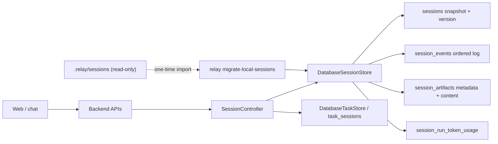

# Database-Only Thread Storage

**Status:** Proposed

**Scope:** Relay threads/sessions and all data owned by them

**Decision:** PostgreSQL is the only runtime source of truth. Filesystem session storage is migration input only.

## Outcome

Every thread is persisted through `DatabaseSessionStore`. This includes the
thread snapshot, ordered event history, human decisions, agent runs, artifact
metadata and retained artifact content, and per-run token usage. The backend
must not start in a mode that can create or mutate `.relay/sessions/**`.

The change also closes the thread-routing defects found during review:

- selected `daemonNodeId` reaches `/agent-runs`;
- cancellation targets the thread's runtime node;
- streamed `agent.started` events retain runtime-affinity metadata;
- deleting a thread removes task relationships rather than leaving dangling
  `linkedSessionIds`.

## Architectural decisions

| Question | Decision | Reason |
|---|---|---|
| Runtime source of truth | PostgreSQL only | One consistency and concurrency model |
| Legacy files | Read only by an explicit importer | Prevent accidental fallback and split brain |
| Cutover method | Offline import, verify, then switch | Event order must remain stable; no dual-write window |
| Conflict handling | Abort on divergent existing IDs | Never overwrite potentially newer database history |
| Artifact retention | Copy retained content into `session_artifacts.content` | A database-backed thread must remain readable without the old directory |
| Startup behavior | Fail fast without a migrated database | Silent fallback would violate the invariant |
| Local tests | PostgreSQL integration tests plus SQLite unit fixtures where dialect-neutral | Keep fast tests, but verify locking and constraints on the production dialect |
| Rollback | Roll back application version/config, not imported data | Imported rows are additive; legacy input remains untouched during validation |

## Target architecture

### Runtime invariant

`create_app()` constructs database stores before exposing routes or starting
the scheduler. A missing URL, unreachable database, pending migration, or
failed schema probe stops startup with a precise remediation message. There is
no `LocalSessionStore` branch and no catch-and-fallback behavior.

### Persistence invariant

For a session with version `N`:

- exactly `N` ordered event rows exist at sequences `0..N-1`;
- `sessions.snapshot.events` contains those same event IDs in that order;
- the snapshot is the materialized cache, while `session_events` remains the
  recoverable history;
- `(session_id, sequence)` and event `public_id` are unique;
- an append locks the session row, inserts the event, materializes the new
  snapshot, updates version, and synchronizes derived usage in one transaction.

Add a maintenance verifier capable of reporting and optionally rebuilding a
snapshot from database events. It must never repair silently during request
handling.

## Legacy import design

Add `relay migrate-local-sessions --source <relay-root> [--dry-run]`.

For each `.relay/sessions/<session-id>` directory:

1. Read `events.jsonl` as authoritative; do not trust `snapshot.json` for
   event membership.
2. Reject malformed JSON, a missing first `session.created`, mismatched
   `sessionId`, duplicate event IDs, or non-monotonic/invalid timestamps.
3. Materialize the events with the current reducer and compare the result with
   the legacy snapshot. Report drift; import the event-derived state.
4. Resolve each artifact from its event:
   - generated text artifact: read its retained local body and store text;
   - workspace artifact with `snapshotPath`: read bytes, base64 encode, and
     store `contentEncoding=base64`;
   - metadata-only workspace artifact: import metadata and explicitly report
     that no retained content exists.
5. Insert the session, events, artifacts, and usage rows in one transaction.
6. If the public session ID already exists:
   - identical ordered event IDs and payload hashes: skip as already imported;
   - any divergence: abort that session and fail the command overall.
7. Emit a machine-readable manifest containing counts, skipped IDs, warnings,
   payload hashes, and failures. Never delete or modify the source tree.

The cutover gate compares source and database totals for sessions, events,
artifacts, retained artifact bytes, completed runs, and token usage. A sample
of sessions is replayed from DB events and compared with stored snapshots.

## Implementation phases

### Phase 1 — Lock down the database model

1. Add `UniqueConstraint("session_id", "sequence")` to
   `DatabaseSessionStore.metadata` so test-created schemas match Alembic.
2. Add indexes used by owner-scoped thread lists and event streaming if they
   are absent at migration head.
3. Add a schema/version readiness probe used during startup.
4. Add database tests for concurrent appends, duplicate event IDs, transaction
   rollback, artifact insertion with its event, and snapshot replay parity.
5. Run those concurrency tests against PostgreSQL, not only SQLite.

**Gate:** the database store passes append/replay/rollback tests and metadata
matches migration head.

### Phase 2 — Build and verify the importer

1. Extract a narrow `SessionStore` protocol so controllers and registry code
   no longer name `LocalSessionStore` as their type/default.
2. Implement the read-only legacy scanner and validation report.
3. Add a transactional `DatabaseSessionStore.import_session(...)` operation;
   do not compose import from public methods that each open a transaction.
4. Implement artifact-content migration and token-usage derivation.
5. Add dry-run, idempotency, conflict, corrupt-log, stale-snapshot, missing
   artifact, and retry tests.
6. Document backup, dry-run, import, verification, and rollback commands.

**Gate:** importing the same fixture twice is a no-op; divergent data fails
without partial rows; stale snapshots import the complete JSONL history.

### Phase 3 — Enforce database-only runtime

1. Change storage configuration so supported runtime values are database-only;
   remove `file`/`local` aliases from production configuration.
2. Make `RELAY_DATABASE_URL` or `DATABASE_URL` mandatory at backend startup.
3. Make `session_store_from_env()` always return `DatabaseSessionStore`.
4. Remove implicit `LocalSessionStore()` defaults from `SessionController`,
   `DaemonNodeRegistry`, and helper type annotations.
5. Stop exporting the local store from public runtime modules. Keep the legacy
   reader under a migration-specific module until one deprecation cycle ends.
6. Update app factory tests, environment tests, docs, examples, Make targets,
   and deployment configuration.

**Gate:** a repository search finds no runtime construction of
`LocalSessionStore`; starting without a database URL fails before routes or
schedulers become active.

### Phase 4 — Make thread lifecycle relationally consistent

1. Introduce `task.session_unlinked` materialization semantics and
   `DatabaseTaskStore.unlink_session()`.
2. On thread deletion, lock/verify that no run is in flight, unlink every task,
   delete the session, its events, artifacts, and usage, then invalidate caches.
3. Prefer a shared database unit-of-work for unlink + session deletion. If the
   existing store boundary cannot share one transaction in this phase, make
   deletion retryable and add a reconciliation job before enabling hard delete.
4. Add tests for linked tasks, repeated deletion, rollback after unlink
   failure, and concurrent run dispatch versus delete.
5. Confirm node/sandbox token scope. If tokens are node/workspace scoped,
   preserve that identity and enforce session workspace/node authorization.

**Gate:** no API response or task snapshot exposes a deleted session ID, and a
failed deletion leaves both aggregates unchanged.

### Phase 5 — Fix the web thread contract

1. Serialize `daemonNodeId` in `runLogicalAgents()` and test the request body.
2. Use `activeRuntimeNode` as cancellation fallback; never use an unrelated
   employee-level selected node for an existing thread.
3. Preserve all supported `agent.started` affinity fields in SSE materialization.
4. Seed returned mutation snapshots consistently and retain polling/SSE parity.
5. Add multi-node create/cancel tests and event-stream parity tests.

**Gate:** the selected computer owns the created run, cancellation reaches that
computer during poll lag, and SSE state equals the next fetched snapshot.

### Phase 6 — Operational cutover

1. Back up PostgreSQL and the legacy `.relay` directory.
2. Deploy migrations while the old backend is stopped.
3. Run importer dry-run; resolve every hard failure.
4. Run import and the count/hash/replay verifier.
5. Start the database-only backend and execute smoke tests: list/open thread,
   stream event, send message, cancel run, download artifact, rename, and delete.
6. Monitor database errors, event append latency, import warnings, SSE failures,
   and thread-count discrepancies.
7. Keep legacy files read-only for a defined rollback window; archive them only
   after sign-off. Never have the new runtime read them.

## Test matrix

| Layer | Required coverage |
|---|---|
| Reducer | Full replay, duplicate starts, terminal events, rename/archive, unlink |
| DB unit | Append atomicity, unique sequences, artifact/event transaction, delete cascade |
| PostgreSQL integration | Concurrent append, row locking, retry behavior, rollback |
| Importer | Dry-run, stale snapshot, corruption, idempotency, conflict, missing content |
| API | Owner scoping, token scope, create/list/get/delete, linked-task cleanup |
| Web | node serialization, pinned-node cancellation, SSE metadata parity |
| Cutover smoke | import counts, open historical thread, artifact retrieval, new run |

## Rollout and rollback

Rollout is intentionally one-way at runtime: once database-only code starts,
new events exist only in PostgreSQL. Rollback therefore means restoring the
previous application version while keeping it configured for PostgreSQL—not
re-enabling filesystem writes. If an emergency version cannot use the database
store, restore the pre-cutover database/filesystem backups together and accept
loss of post-cutover activity explicitly; do not attempt ad-hoc reverse sync.

## Definition of done

- No production path constructs or falls back to `LocalSessionStore`.
- No thread mutation writes beneath `.relay/sessions`.
- Every legacy session is imported, explicitly skipped as identical, or listed
  as a blocking error.
- Database event replay and stored snapshots agree.
- Artifacts remain downloadable without the legacy directory.
- Linked tasks contain no deleted session IDs.
- Multi-node create/cancel behavior is correct.
- PostgreSQL concurrency, migration, API, web, and cutover smoke suites pass.
- Documentation states PostgreSQL as mandatory and contains recovery steps.

## Recommended delivery slices

1. **DB correctness:** metadata parity, constraints, PostgreSQL concurrency tests.
2. **Migration tooling:** scanner, importer, verifier, operator documentation.
3. **Runtime cutover:** mandatory DB configuration and removal of local wiring.
4. **Lifecycle integrity:** task unlink/delete unit of work and token scoping.
5. **Web correctness:** node routing, cancellation, and SSE parity.
6. **Deployment:** rehearsal on a copied data set, production cutover, monitoring.

Do not combine importer construction and production cutover in one release.
Ship and rehearse the importer first, then enforce database-only startup after
the migration report is clean.
