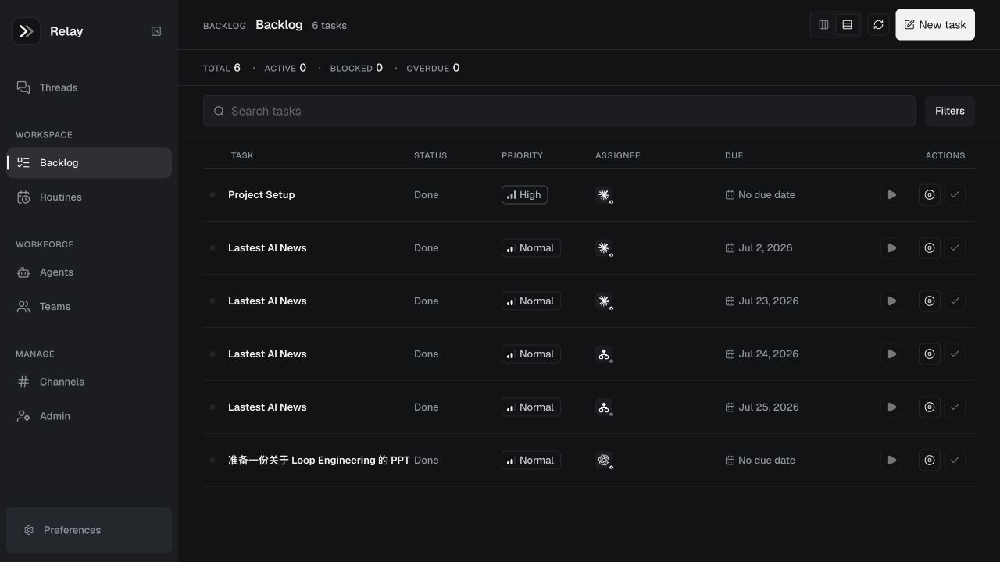
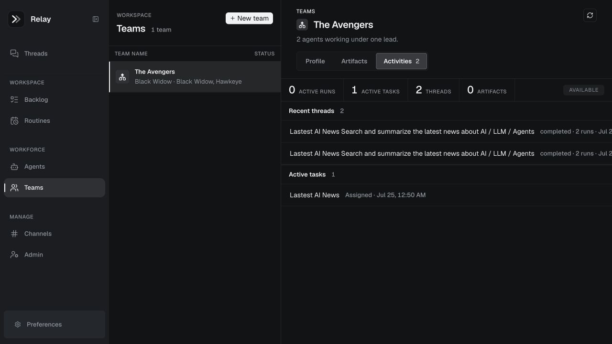
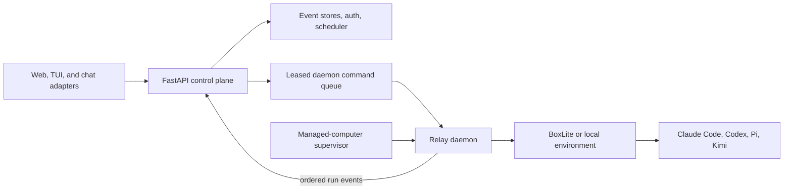

# Relay

<p align="center">
  
</p>

<p align="center"><strong>Every Employee. Amplified.</strong></p>

Relay is a local-first control plane for AI work. Employees can start threads,
assign durable tasks, schedule routines, and coordinate named AI agents and
teams. Relay keeps identity, policy, approvals, history, and computer placement
in one place while Claude Code, Codex, Pi, and Kimi execute through daemon
processes.

<p align="center">
  
</p>

This repository contains the developer MVP: a Python/FastAPI control plane,
TypeScript daemons and clients, a Next.js web app, database-backed thread and
task storage, and BoxLite-backed execution. Relay can also run an agent on an
employee's existing computer without BoxLite.

## What works today

- Threaded chat with explicit agent, computer, and Ask, Action, or Review mode.
- A task backlog and recurring routines with assignment, scheduling, dispatch,
  and event history.
- Named agents and teams with profiles, files, generated artifacts, and recent
  activity.
- Local computers and managed computers with durable names, agent placement,
  health, command leases, and restart-safe enrollment.
- Daemon execution for Claude Code, Codex, Pi, and Kimi, including streamed tool
  output and normalized token usage.
- Human approval, cancellation, retry, and handoff flows in the TUI.
- A provider-neutral chat gateway with Discord, Telegram, and Lark adapters.
- Admin views for employees, computers, fleet health, activity, and token usage.
- Database-backed thread and task event stores, with optional file-backed
  development stores only for non-thread operational state.

The backend never runs an agent CLI. It records state and queues commands. A
daemon claims each command, executes it in BoxLite or a configured local
environment, and streams ordered events back to the control plane.

## Product snapshots

### Plan and dispatch work

The backlog keeps priority, assignee, due date, status, and dispatch controls in
one view.

<p align="center">
  
</p>

### Coordinate agent teams

Team workspaces collect active tasks, threads, artifacts, and member activity.

<p align="center">
  
</p>

## Quick start

### Prerequisites

- Node.js 22.19 or newer
- npm
- Python 3.12 or newer
- [uv](https://docs.astral.sh/uv/)
- Docker and hardware virtualization when using BoxLite
- Credentials or local login state for the agent CLIs you want to run

Install the workspace and run the test suite:

```bash
npm install
npm test
```

Configure authentication, storage, and agent credentials as described in
[Local Development](docs/local-development.md). Then start the services in
separate terminals:

```bash
make backend                     # FastAPI control plane on 127.0.0.1:8790
make daemon SANDBOX_ID=node_dev  # execution node connected to the backend
make web                         # Next.js app on 127.0.0.1:5000
```

Open <http://127.0.0.1:5000>. Run `make run` in another terminal if you also
want the Ink TUI.

Useful commands:

```bash
make supervisor         # reconcile requested managed computers
make backend-migrate    # apply Alembic migrations
make pre-commit-run     # run repository checks
make stop               # stop Relay, daemon, supervisor, TUI, and BoxLite
```

Rebuild the BoxLite devbox with `make run-fresh` only after changing
`dockerfile` or the image contents.

## Architecture



The control plane owns sessions, tasks, agent and team identity, computer
placement, policy, and audit history. Daemons own execution and workspace
access. The supervisor reconciles requested managed computers into daemon
processes; its current provider runs local processes, with a command-template
provider available for external infrastructure.

### Repository map

- `backend/`: FastAPI application, auth, event stores, task scheduler, agent and
  team services, managed-computer state, and HTTP routes.
- `packages/relay-core/`: shared protocol, command builders, prompts, renderers,
  token accounting, and client helpers.
- `packages/relay-chat/`: chat gateway plus Discord, Telegram, and Lark
  adapters.
- `packages/relay-daemon/`: computer registration, leased command polling,
  workspace access, BoxLite lifecycle, and agent execution.
- `packages/relay-supervisor/`: managed-computer reconciliation and provider
  lifecycle.
- `packages/relay-tui/`: Ink terminal interface and approval, retry, cancel, and
  handoff commands.
- `web/`: Next.js interface for threads, backlog, routines, agents, teams,
  channels, and administration.

## State and storage

Thread/session state is always stored in the configured database. Local
development may still store non-thread generated state under `.relay/`.
Agent workspace views use live daemon reads when a computer is online and fall
back to generated-file snapshots when possible.

Configure `RELAY_DATABASE_URL` (or `DATABASE_URL`) before starting the backend;
threads, ordered events, artifact snapshots, token usage, tasks, and thread-task
links are database-only.
Set `RELAY_STORAGE=postgres` to place the remaining control-plane records in
PostgreSQL as well.

## Documentation

- [Local Development](docs/local-development.md): setup, environment, service
  commands, data layout, and tests.
- [Product Design](docs/product.md): product direction, users, scenarios, and
  roadmap.
- [Architecture Design](docs/system-architecture.md): target planes, sandbox
  strategy, MCP gateway, memory, and governance.
- [Technical Implementation Design](docs/implementation-plan.md): components,
  data model, APIs, security, and rollout phases.
- [Chat Integrations](docs/chat-integrations.md): provider adapters, identity
  mapping, commands, and security.
- [Architecture Decisions](docs/adr/README.md): accepted decisions for
  governance, sandboxing, and control-plane boundaries.
- [Visual Design](docs/design-system.md): product and brand design system.
- [Brand Assets](assets/brand/README.md): logo files and color tokens.

## Verification

```bash
npm run build
npm run test:ts
npm run test:py
npm test
```

Use focused tests while developing, then run `npm test` before handing off a
behavior change.
