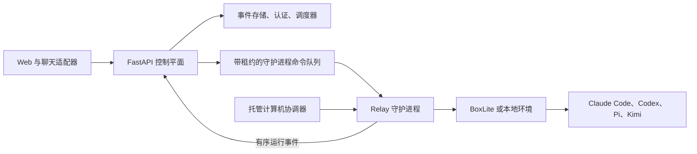

# Relay

[English](README.md) | [简体中文](README.zh-CN.md)

<p align="center">
  
</p>

<p align="center"><strong>让每一位员工，能力倍增。</strong></p>

Relay 是一个本地优先的 AI 工作控制平面。员工可以发起对话、分配持久任务、安排例行任务，并协调具名 AI 智能体与团队。Claude Code、Codex、Pi 和 Kimi 通过守护进程执行工作，Relay 则统一管理身份、策略、审批、历史记录和计算机部署位置。

<p align="center">
  
</p>

本仓库包含开发者 MVP：Python/FastAPI 控制平面、TypeScript 守护进程与客户端、Next.js Web 应用、数据库支持的对话与任务存储，以及基于 BoxLite 的执行环境。Relay 也可以不使用 BoxLite，直接在员工现有的计算机上运行智能体。

## 当前功能

- 支持显式选择智能体、计算机以及“询问”“执行”或“审查”模式的对话。
- 支持分配、排期、派发和事件历史的任务看板与周期性例行任务。
- 带有资料、文件、生成产物和近期活动的具名智能体与团队。
- 具备持久名称、智能体部署、健康状态、命令租约和可恢复注册的本地及托管计算机。
- 通过守护进程执行 Claude Code、Codex、Pi 和 Kimi，并流式输出工具结果、统一统计令牌用量。
- Web 应用中的人工审批、取消、重试和交接流程。
- 带 Discord、Telegram 和 Lark 适配器的供应商中立聊天网关。
- 面向员工、计算机、集群健康、活动和令牌用量的管理视图。
- 数据库支持的对话与任务事件存储；仅非对话运行状态可在开发环境中选择文件存储。

后端绝不直接运行智能体 CLI。它只记录状态并排队命令。守护进程领取命令后，在 BoxLite 或配置好的本地环境中执行，并将有序事件流回控制平面。

## 产品截图

### 规划并派发工作

任务看板在同一视图中管理优先级、负责人、截止日期、状态和派发控制。

<p align="center">
  
</p>

### 协调智能体团队

团队工作区集中展示进行中的任务、对话、产物和成员活动。

<p align="center">
  
</p>

## 快速开始

### 前置条件

- Node.js 22.19 或更高版本
- npm
- Python 3.12 或更高版本
- [uv](https://docs.astral.sh/uv/)
- 使用 BoxLite 时需要 Docker 和硬件虚拟化支持
- 所需智能体 CLI 的凭据或本地登录状态

安装工作区依赖并运行测试：

```bash
npm install
npm test
```

按照[本地开发指南](docs/local-development.md)配置认证、存储和智能体凭据，然后在不同终端中启动服务：

```bash
make backend                     # FastAPI 控制平面，监听 127.0.0.1:8790
make daemon SANDBOX_ID=node_dev  # 连接后端的执行节点
make web                         # Next.js 应用，监听 127.0.0.1:5000
```

打开 <http://127.0.0.1:5000>。

常用命令：

```bash
make supervisor         # 协调所申请的托管计算机
make backend-migrate    # 应用 Alembic 数据库迁移
make pre-commit-run     # 运行仓库检查
make stop               # 停止 Relay、守护进程、协调器和 BoxLite
```

仅在修改 `dockerfile` 或镜像内容后，才使用 `make run-fresh` 重建 BoxLite 开发镜像。

## 架构



控制平面负责对话、任务、智能体与团队身份、计算机部署、策略和审计历史；守护进程负责执行和工作区访问。协调器将所申请的托管计算机协调为守护进程。当前供应商在本地启动进程，同时也支持通过命令模板接入外部基础设施。

当前仓库结构、状态归属和运行不变量维护在 [`AGENTS.md`](AGENTS.md) 中。目标架构及其实施蓝图位于 [`docs/system-architecture.md`](docs/system-architecture.md) 和 [`docs/implementation-plan.md`](docs/implementation-plan.md)。

## 文档

从 [`docs/` 中文索引](docs/README.zh-CN.md)开始。该索引标明了环境搭建、API、产品、架构、设计、决策和运维指南各自的权威文档。
